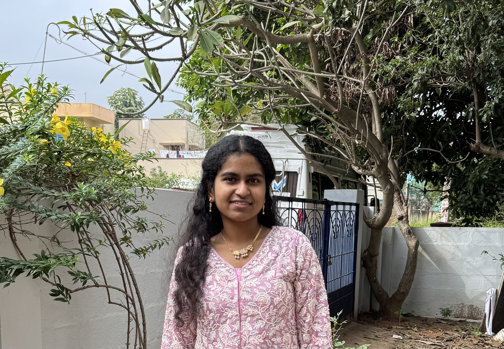

# Portfolio

## 📚 Table of Contents

- [Portfolio](#portfolio)
  - [📚 Table of Contents](#-table-of-contents)
- [Hello, I'm Renee 👩🏽‍💻](#hello-im-renee-)
  - [Why computer Science](#why-computer-science)
    - [Other interests](#other-interests)
    - [💬 Favorite Quote](#-favorite-quote)
  - [✍️ About Me](#️-about-me)
  - [🔢 My Favorite Languages](#-my-favorite-languages)
  - [💻 Code Sample](#-code-sample)
  - [Task List](#task-list)


# Hello, I'm Renee 👩🏽‍💻
Welcome to my User Page! I'm a student, a programmer, and a lifelong learner.  
I'm currently exploring **GitHub Pages** and writing in *Markdown*!


## Why computer Science
I chose computer science because I enjoy solving problems and learning how things work. I like that I can use technology to build cool things that help people.

During my internship, I was introduced to cloud tools and worked on organizing data for projects. That experience helped me realize how powerful cloud platforms are, and I found that I really enjoy working with data and keeping it structured.

---

### Other interests
1. Tennis
2. Listening to Music
3. Reading books
4. Formula 1
   * I love to watch the latest updates on [F1 TV](https://www.formula1.com/) — it’s one of my favorite ways to unwind after coding! 


### 💬 Favorite Quote

> “Code is like humor. When you have to explain it, it’s bad.” – Cory House

---

## ✍️ About Me

- I'm passionate about Python and cloud computing.
- I love building things that help people.
- I’m currently learning more about SE and AI and ML.
- Here's a [link to my README](./README.md)
- One of my favorite commands is ``git commit -m "Initial commit"`` because that’s when everything becomes real!


---

## 🔢 My Favorite Languages

1. Python  
2. Java
3. Azure cloud (cloud computing)

---

## 💻 Code Sample

```python
def greet(name):
    return f"Hello, {name}!"
```

---

## Task List
Create a new file called index.md in whatever branch you like. This is where you'll create your User Page, which should include content that introduces who you are as a programmer and as a person. Your User Page must be made with Markdown. For this assignment, your page must include the following:

- [x] Pictures 
- [x] Headings
- [x] Styling text
- [x] Quoting text
- [x] Quoting code
- [x] External Links (Link to another webpage)
- [x] Section links (Link to a header in the same .md file)
- [x] Relative links (Link to another .md file or an image in your repo. If linking to an image, encode it as a regular link rather than an image.)
- [x] Ordered and Unordered Lists
- [x] Task List
